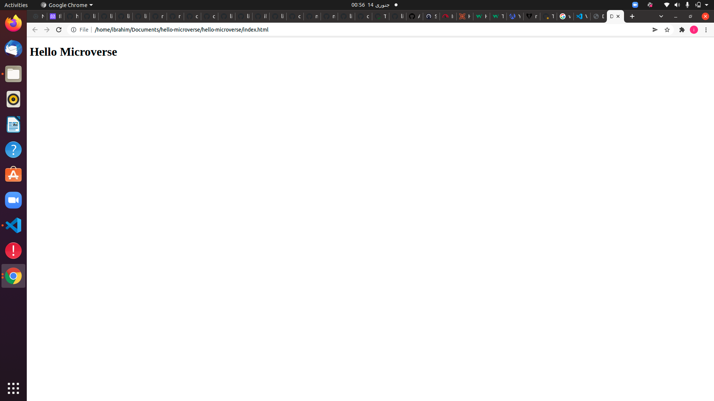

# Set up a "Hello Microverse" 

> In this project, you will set up a "Hello world" repository. No complex coding is required for this exercise. Your goal here is to master all of the tools and best practices you learned about in previous steps. You will be using them in all Microverse projects and most likely in your future job as well, so it is important to know them!

Additional description about the project 
## Built With

- Html 
- Css

## Authors

👤 **Author1**

- GitHub: [@githubhandle](https://github.com/ibrahim777764)

## � License

This project is [MIT](./MIT.md) licensed.
